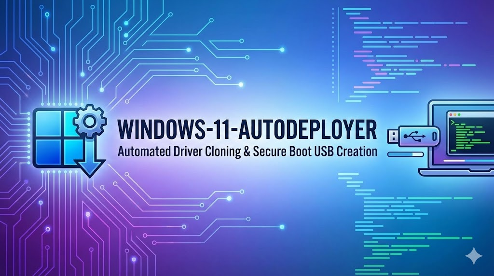

# Windows 11 AutoDeployer

<div align="center">
  
</div>

# Windows-11-AutoDeployer

An automated, end-to-end PowerShell utility designed to create a customized, bootable Windows 11 installation USB. This script downloads a base Windows image, clones the drivers from the active host machine, injects them into the installation media, and prepares a Secure Boot-compliant USB drive.

Ideal for system administrators, IT professionals, and hardware enthusiasts looking to automate deployment and create "self-replicating" installation media tailored to a specific hardware profile.

## ✨ Key Features

* **Host Driver Cloning (`Export-WindowsDriver`):** Automatically extracts all third-party drivers (Network, Audio, Chipset, GPU) currently running on the host machine.
* **Automated DISM Injection:** Handles the mounting, injection, and committing of drivers into the Windows Image (`install.wim` / `install.esd`) seamlessly.
* **Intelligent Image Conversion:** Detects compressed `.esd` files and natively converts them to editable `.wim` formats on the fly.
* **Secure Boot Revocation Fix (EFI Transplant):** Replaces older, potentially revoked bootloaders (`bootx64.efi`) in the ISO with the healthy, signed bootloader from the active host OS. This prevents the "Security Violation" red screen in Rufus or native boot setups.
* **Automated USB Provisioning:** Detects removable drives, formats them to UEFI-required FAT32, and handles the file transfer automatically.
* **Large File Splitting (`.swm`):** Automatically detects if the customized `install.wim` exceeds the 4GB FAT32 file size limit and uses DISM to split the image into smaller `.swm` chunks for seamless Windows Setup integration.

## ⚠️ Prerequisites

* **Operating System:** Windows 10 or Windows 11.
* **Privileges:** Must be executed in an **Elevated PowerShell Session** (Run as Administrator).
* **Storage Space:** At least 20GB of free space on the `C:\` drive for the temporary staging area (`C:\Temp\Win11_Build`).
* **USB Flash Drive:** An empty USB drive (8GB minimum, 16GB+ recommended). **All data on the selected drive will be destroyed.**

## 🚀 How It Works (The Pipeline)

1.  **Workspace Prep:** Cleans up previous incomplete mounts and builds a fresh directory structure in `C:\Temp`.
2.  **Driver Export:** Scans the live system and exports all active `.inf` drivers to a staging folder.
3.  **Media Acquisition:** Prompts the user to provide the base Windows 11 ISO.
4.  **Extraction & Conversion:** Mounts the ISO, copies the contents, and converts `install.esd` to `install.wim` if necessary.
5.  **Driver Injection:** Uses DISM to mount the WIM index and inject the exported drivers via `/ForceUnsigned`.
6.  **Bootloader Sanitization:** Copies the host machine's `bootmgfw.efi` to the staging media, ensuring the final USB passes Secure Boot checks.
7.  **USB Formatting:** Lists available USB drives, awaits user confirmation (`DESTROY`), and formats the target to FAT32.
8.  **WIM Splitting & Transfer:** Copies all installation files to the USB. If the `install.wim` exceeds 4GB, it splits it into `<4GB` `.swm` chunks to comply with FAT32 limitations.

## 🛠️ Usage Instructions

1.  Download the `Deploy_Win11_USB.ps1` script to your local machine.
2.  Right-click the `.ps1` file and select **Run with PowerShell**, OR open an Administrator PowerShell prompt and execute:
    ```powershell
    .\Deploy_Win11_USB.ps1
    ```
3.  A browser window will open to download the base ISO. Once downloaded, drag and drop the ISO file path into the PowerShell console when prompted.
4.  Follow the on-screen prompts to select the correct Windows Index (Usually `1` or `6`).
5.  When prompted for the USB target, enter the corresponding **Disk Number** and type `DESTROY` to authorize formatting.
6.  Wait for the file transfer and `.swm` splitting to complete. 

## 📝 Notes & Troubleshooting

* **Error 0xc1510111 (Read-Only):** The script automatically strips the `Read-Only` attribute from files copied off the virtual ISO to prevent DISM commit failures.
* **Cross-Hardware Deployment:** This script is designed to create media *for the machine it was built on* (due to the driver cloning). Using the resulting USB on a completely different manufacturer/model may result in missing drivers or blue screens during setup.

## 🛑 Disclaimer

This script formats physical disk drives. Ensure you select the correct USB Disk Number when prompted. The author is not responsible for accidental data loss. Always verify your drive selections.
